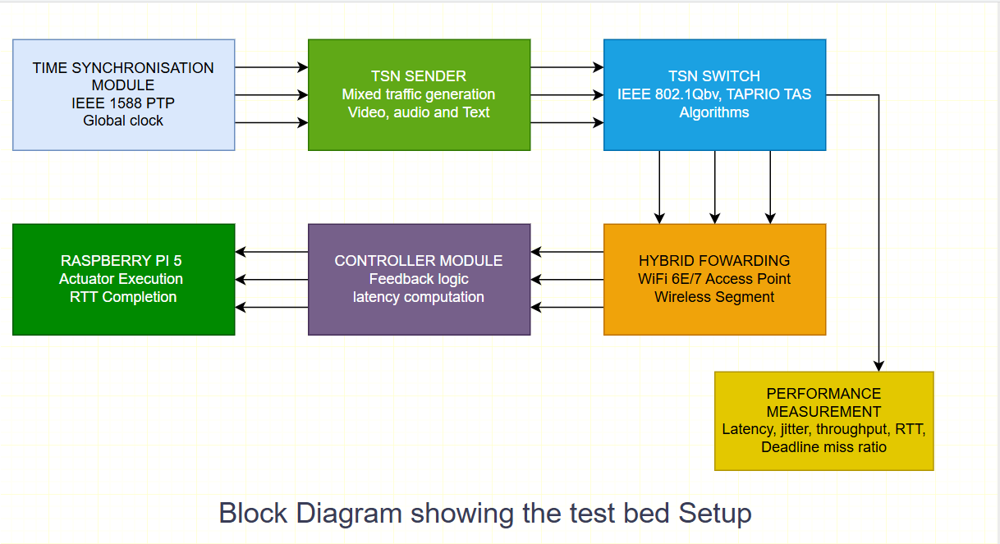

# Hardware Implementation

## Overview

This section contains the experimental implementation of a hybrid Time-Sensitive Networking (TSN) environment used to evaluate deterministic communication across network nodes. The setup focuses on validating priority-based traffic transmission and latency behaviour under mixed traffic conditions.

The implementation generates multiple traffic classes representing video, audio, and text streams, each mapped to different priority levels. VLAN tagging and priority mapping mechanisms are used to differentiate traffic classes, enabling scheduled forwarding and deterministic packet handling.

Time synchronisation across participating systems is maintained to ensure accurate timestamping and latency measurement. The system records key performance metrics such as one-way latency, round trip time (RTT), jitter, throughput, and deadline miss ratio for further analysis.

## System Architecture

The experimental setup follows a hybrid wired to wireless TSN architecture. The block diagram below illustrates the overall communication flow and module interaction used in the testbed.

## Implementation Components

The implementation includes the following components:

- Traffic generation for mixed priority data streams  
- VLAN tagged packet transmission and reception  
- Timestamp based latency and RTT measurement  
- Logging and dataset generation for performance evaluation  

The collected results provide experimental observations of deterministic communication behaviour and are used for analysing scheduling strategies and network performance.
